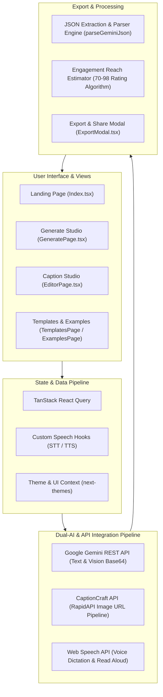

# CapSync: AI-Powered Social Media Caption Engine & Creative Studio


[](https://reactjs.org/)
[](https://vitejs.dev/)
[](https://www.typescriptlang.org/)
[](https://tailwindcss.com/)
[](https://ai.google.dev/)
[](https://vitest.dev/)

---

## Executive Overview

**CapSync** is an enterprise-grade, AI-powered content creation engine and creative studio engineered for social media managers, digital marketers, and content creators. By harnessing **Google Gemini Large Language Models (LLMs)** alongside multimodal vision processing and secondary API pipelines, CapSync turns raw ideas, audio dictations, or visual media into platform-optimized, high-converting social media captions in seconds.

Whether crafting viral threads for X (Twitter), long-form professional insights for LinkedIn, visual stories for Instagram, or quick broadcasts for WhatsApp, CapSync ensures brand voice consistency, high audience engagement, and optimized hashtag distribution.

---

## System Architecture

CapSync is constructed on a modern client-side single-page application (SPA) architecture emphasizing low-latency streaming, resilient API error recovery, modular UI composition, and optimized chunk bundling.



---

## Key Features & Capabilities

### 1. Dual-AI Multimodal Engine
- **Google Gemini Integration**: Handles rich prompt analysis, base64 image vision processing, context-aware caption variant generation, and deep conversational strategy advice.
- **CaptionCraft RapidAPI Integration**: Provides secondary image URL analysis for web-hosted media links.
- **Resilient JSON Normalization**: Uses strict fallback parsing (`parseGeminiJson` & `normalizeCaptionFromApi`) to extract structured JSON responses even from non-deterministic LLM markdown outputs.

### 2. Visual & Contextual Intelligence
- **Direct Image Uploads**: Upload JPEG, PNG, or WebP images to generate captions tailored to exact visual elements, color schemes, and subject matter.
- **Image URL Ingestion**: Analyze online image assets instantly without manual downloads.

### 3. Custom Tone & Persona Customization
- **Prebuilt Vibes**: Choose from curated tones including *Aesthetic, Funny, Professional, Bold, Minimalist, Witty, or Motivational*.
- **Persona Selector ([PersonaSelector.tsx](file:///c:/Users/91994/Desktop/Projects/capsync/src/components/PersonaSelector.tsx))**: Tailor AI output to mirror specific brand personalities, creator voices, or corporate identities.

### 4. Agent Mode: Senior Social Media Strategist
- **Virtual AI Consultant ([AgentMode.tsx](file:///c:/Users/91994/Desktop/Projects/capsync/src/components/AgentMode.tsx))**: An interactive chat interface simulating a Senior Content Strategist for content audits, campaign brainstorming, performance tips, and hook optimization.

### 5. 🎤 Voice Dictation & Text-to-Speech (STT / TTS)
- **Voice Dictation ([VoiceInput.tsx](file:///c:/Users/91994/Desktop/Projects/capsync/src/components/VoiceInput.tsx))**: Hands-free speech-to-text dictation for drafting prompts.
- **Read Aloud TTS**: Preview how your captions sound when spoken across customizable voice styles (*Podcast, Narrator, Storyteller*).

### 6. 📈 Predictive Engagement & Platform Optimization
- **Reach Score Algorithm**: Calculates an AI-driven engagement prediction score (70–98) for each generated caption variation.
- **Platform Specific Rules**: Formats text, character counts, line breaks, and hashtag volume specifically for **Instagram**, **LinkedIn**, **X (Twitter)**, and **WhatsApp**.
- **Platform Analytics Tips**: Recommends peak posting times and target audience insights tailored to each network.

### 7. ✏️ Interactive Caption Studio & Multi-Channel Export
- **Caption Editor ([EditorPage.tsx](file:///c:/Users/91994/Desktop/Projects/capsync/src/pages/EditorPage.tsx))**: Real-time editor with line counter, emoji picker, hashtag insertion tools, and live preview cards.
- **Export Engine ([ExportModal.tsx](file:///c:/Users/91994/Desktop/Projects/capsync/src/components/ExportModal.tsx))**: Download captions as `.txt` files, copy formatted copy to clipboard, or route directly to native platform sharing.

---

## 🛠️ Complete Tech Stack

| Category | Technology | Usage & Purpose |
| :--- | :--- | :--- |
| **Core Framework** | [React 18.3](https://reactjs.org/) | Declarative component UI hierarchy |
| **Build Tooling** | [Vite 5.4](https://vitejs.dev/) with [SWC](https://swc.rs/) | High-speed HMR & bundled compilation |
| **Language** | [TypeScript 5.8](https://www.typescriptlang.org/) | End-to-end static type safety |
| **Styling System** | [Tailwind CSS 3.4](https://tailwindcss.com/) | Utility-first responsive design system |
| **UI Primitives** | [Shadcn UI](https://ui.shadcn.com/) / [Radix UI](https://www.radix-ui.com/) | Accessible dialogs, tooltips, accordions, & popovers |
| **Motion & Animation** | [Framer Motion 12](https://www.framer.com/motion/) | Dynamic page transitions and micro-animations |
| **State & Async Data** | [TanStack React Query v5](https://tanstack.com/query/latest) | Server state management and API caching |
| **Routing** | [React Router DOM v6](https://reactrouter.com/) | Client-side page navigation |
| **AI Integration** | Google Gemini REST API & RapidAPI | Multi-model LLM generation & visual recognition |
| **Data Visualization** | [Recharts](https://recharts.org/) | Analytics & score visualization charts |
| **Testing Framework** | [Vitest](https://vitest.dev/) + React Testing Library | Unit tests and DOM assertion testing |
| **Analytics & Insights**| Vercel Analytics & Speed Insights | Real-time user performance metrics |

---

## 📁 Project Architecture & File Directory

```text
capsync/
├── .env                       # API Credentials & Environment variables
├── .env.local                 # Local environment overrides
├── eslint.config.js           # Flat ESLint configuration rules
├── package.json               # Dependencies and build scripts
├── postcss.config.js          # PostCSS configuration for Tailwind
├── tailwind.config.ts         # Custom Tailwind color tokens and theme extensions
├── tsconfig.json              # TypeScript root configuration
├── vite.config.ts             # Vite build settings & manual chunk definitions
├── vitest.config.ts           # Vitest unit test runner settings
├── Documentation/             # Architecture screenshots and visual assets
└── src/
    ├── App.css                # Global style overrides
    ├── App.tsx                # App router, global query provider, and layout shell
    ├── index.css              # Tailwind base, components, and utility imports
    ├── main.tsx               # Application entry point
    ├── assets/                # Static brand graphics and media
    ├── components/            # Application UI components
    │   ├── AgentMode.tsx      # Virtual Social Media Strategist chat component
    │   ├── ExportModal.tsx    # Multi-format caption export and download modal
    │   ├── Navbar.tsx         # Responsive header navigation
    │   ├── NavLink.tsx        # Navigation link wrapper with active states
    │   ├── PersonaSelector.tsx# Custom tone & brand persona manager
    │   ├── StreamingCaption.tsx# Typewriter style streaming text animator
    │   ├── ThemeToggle.tsx    # Dark/Light mode theme switch
    │   ├── VoiceInput.tsx     # Speech-to-Text dictation component
    │   └── ui/                # Reusable Shadcn UI component primitives (Button, Card, Dialog, Toast, etc.)
    ├── hooks/                 # Custom React hooks
    │   ├── use-mobile.tsx     # Responsive mobile breakpoint detector
    │   └── use-toast.ts       # Global toast notification management
    ├── lib/                   # Utility helpers
    │   └── utils.ts           # Class merging (clsx + tailwind-merge)
    ├── pages/                 # Main application view routes
    │   ├── EditorPage.tsx     # Interactive caption editor & studio
    │   ├── ExamplesPage.tsx   # Curated showcase of top-performing captions
    │   ├── GeneratePage.tsx   # Core AI caption generator page
    │   ├── Index.tsx          # Landing page with hero banner & features
    │   ├── NotFound.tsx       # 404 error page
    │   └── TemplatesPage.tsx  # Prebuilt caption prompts and blueprints
    └── test/                  # Test suites
        ├── example.test.ts    # Sample unit test specs
        └── setup.ts           # Vitest matchers setup
```

---

## Performance Optimizations

CapSync achieves top-tier performance scores through strategic asset management and build-time bundling rules in [vite.config.ts](file:///c:/Users/91994/Desktop/Projects/capsync/vite.config.ts):

### Manual Chunk Splitting
To optimize browser caching and prevent large bundle overhead, third-party libraries are isolated into dedicated vendor chunks:

- **`react-vendor`**: Core React runtime (`react`, `react-dom`, `react-router-dom`).
- **`ui-vendor`**: Accessible Radix primitives, Lucide icons, and Tailwind utility helpers (`class-variance-authority`, `clsx`, `tailwind-merge`).
- **`motion-vendor`**: Framer Motion animation engine.
- **`chart-vendor`**: Recharts plotting engine.

This vendor chunking structure guarantees that initial bundle downloads remain below **500 kB**, ensuring fast page loads and smooth client performance.

### Polyfill Database Sync
CapSync leverages an up-to-date `caniuse-lite` database via `baseline-browser-mapping` to eliminate redundant CSS/JS polyfills while maintaining browser cross-compatibility.

---

## Getting Started

### Prerequisites
- **Node.js**: `v18.0.0` or higher
- **Package Manager**: `npm` (v9+) or `bun` (v1+)

### 1. Clone the Repository
```bash
git clone https://github.com/callmyselfasaarya/capsync.git
cd capsync
```

### 2. Install Dependencies
```bash
npm install
# or
bun install
```

### 3. Configure Environment Variables
Create a `.env` file in the project root directory:

```env
# Google Gemini API Key for text generation & vision analysis
VITE_GEMINI_API_KEY=your_gemini_api_key_here

# RapidAPI Key for CaptionCraft image URL processing
VITE_CAPTIONCRAFT_API_KEY=your_rapidapi_key_here
```

### 4. Launch Development Server
```bash
npm run dev
```
Open [http://localhost:8080](http://localhost:8080) or [http://localhost:5173](http://localhost:5173) in your browser to start building.

---

## 📜 Available NPM Scripts

| Script | Command | Description |
| :--- | :--- | :--- |
| **`dev`** | `vite` | Starts local Vite development server with HMR |
| **`build`** | `vite build` | Compiles production-ready optimized build bundle |
| **`build:dev`**| `vite build --mode development` | Builds bundle in development mode for debugging |
| **`preview`** | `vite preview` | Previews production build build output locally |
| **`lint`** | `eslint .` | Executes ESLint flat config code quality checks |
| **`test`** | `vitest run` | Runs unit tests once via Vitest |
| **`test:watch`**| `vitest` | Runs unit test suite in interactive watch mode |

---

## 🤝 Contributing

Contributions are welcome! Please follow these steps to contribute:
1. Fork the repository.
2. Create your feature branch (`git checkout -b feature/AmazingFeature`).
3. Commit your changes (`git commit -m 'Add some AmazingFeature'`).
4. Push to the branch (`git push origin feature/AmazingFeature`).
5. Open a Pull Request.

---

## 📄 License

Distributed under the MIT License. See `LICENSE` for more information.